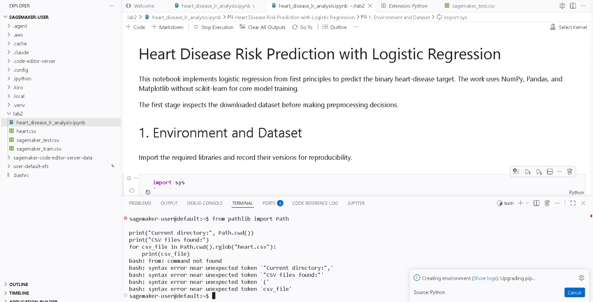
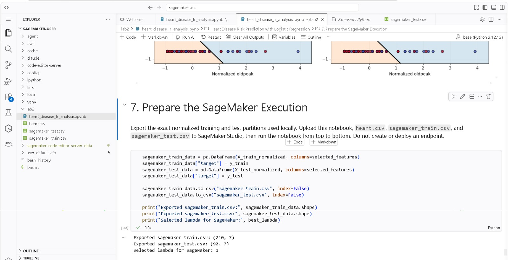

# Heart Disease Risk Prediction

This project implements logistic regression from first principles for heart-disease risk prediction. It covers exploratory analysis, a manual stratified split, normalization, binary cross-entropy optimization, decision boundaries, L2 regularization, and preparation for training and testing in Amazon SageMaker. The core model uses NumPy rather than scikit-learn.

## Dataset

The repository contains `heart.csv`, downloaded from the [John Smith Heart Disease Dataset on Kaggle](https://www.kaggle.com/datasets/johnsmith88/heart-disease-dataset). The assignment also references the [Neurocipher dataset page](https://www.kaggle.com/datasets/neurocipher/heartdisease). The downloaded file contains 1,025 rows, including 723 exact duplicates; the analysis removes those duplicates and documents the resulting 302 unique records.

## Requirements

- Python
- NumPy
- Pandas
- Matplotlib
- Jupyter Notebook

## Run locally

1. Install the required libraries.
2. Keep `heart.csv` beside `heart_disease_lr_analysis.ipynb`.
3. Open the notebook and run all cells from top to bottom.

The notebook exports `sagemaker_train.csv` and `sagemaker_test.csv` using the same normalized split used for local evaluation.

## Main local result

The six-feature model reaches approximately 0.739 accuracy, 0.732 precision, 0.820 recall, and 0.774 F1 on the held-out test subset. Among the tested regularization strengths, `lambda = 1` reduces the weight norm and slightly lowers test binary cross-entropy without changing the threshold-based test metrics. These instructional results are not evidence of clinical validity.

## SageMaker training and testing

The notebook was also run in AWS Academy SageMaker Code Editor using the base Python 3.12.13 kernel. The cloud run reproduced the prepared data exports: 210 training rows and 92 test rows, each with six features plus the target column. It also retained `lambda = 1` as the selected regularization strength. No endpoint was created or deployed.

### Evidence collected

The screenshots are stored in [`evidence/`](evidence/):

- Course SageMaker environment used as the cloud workspace:

  

- Initial setup issue: Python code was entered in the Bash terminal, which explains the displayed syntax errors. The correction was to execute Python only in notebook code cells.

  

- Corrected project execution in the base Python 3.12.13 kernel. The output confirms the exported training and test files and the selected regularization value.

  

The test metrics reported above come from the executed notebook. A separate SageMaker screenshot focused on the metrics table can be added later if the submission requires visual proof of that specific output.
